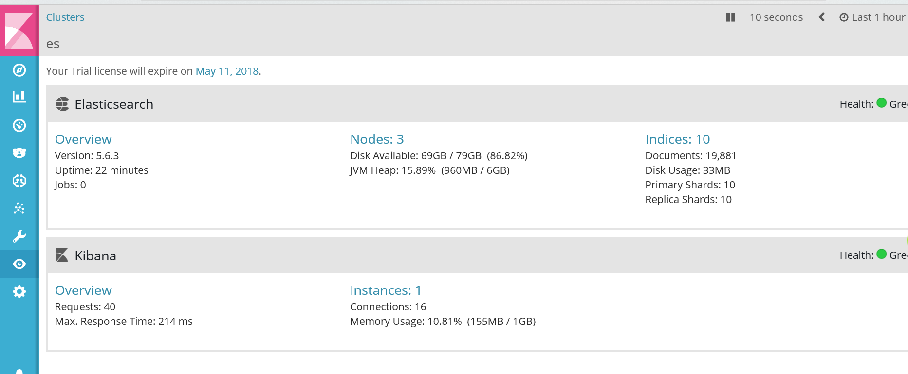

ES集群搭建  
===  
角色规划： 
* hadoop-1  master datanode  
* hadoop-2  master datanode  
* hadoop-3  datanode  

1.OS信息  
---  
* OS-->CentOS7.2
* Elasticsearch-->5.6.3
* kibana-->5.6.3  

2.环境配置  
---  
修改sysctl.conf  
```bash
more /etc/sysctl.conf
```
添加  
```vim
vm.max_map_count=655360
```
修改limits.conf  
```bash
more /etc/security/limits.conf
```
添加  
```vim
*  soft  nofile  65536
*  hard  nofile  131072
*  soft  nproc  4096
*  hard  nproc 4096
```
创建es账户  
```bash
sysctl -p
#使配置生效
useradd es
passwd es
```


3.集群部署  
---  
切换到es用户下  
```bash
su - es
wget https://artifacts.elastic.co/downloads/elasticsearch/elasticsearch-5.6.3.tar.gz
wget https://artifacts.elastic.co/downloads/kibana/kibana-5.6.3-linux-x86_64.tar.gz
tar -zxf elasticsearch-5.6.3.tar.gz
tar -zxf kibana-5.6.3-linux-x86_64.tar.gz
mkdir data
mkdir log
```
修改pei'zhi配置文件   
```bash
vi elasticsearch-5.6.3/config/elasticsearch.yml
```
hadoop-1节点
修改如下：  
```yml
cluster.name: es
node.name: hadoop-1
node.master: true
node.data: true
path.data: /home/es/data
path.logs: /home/es/log
bootstrap.memory_lock: true
bootstrap.system_call_filter: false
network.host: 192.168.1.115
http.port: 9200
discovery.zen.ping.unicast.hosts: ["192.168.1.115", "192.168.1.116", "192.168.1.117"]
discovery.zen.minimum_master_nodes: 2
```
参数信息  
```yml
cluster.name： 指定集群名字  
node.name：  指定节点名字  
node.master： true表示作为master节点，false表示不作为master节点  
node.data： 是否作为data节点  
path.data： 数据存放路径  
path.logs： 日志路径  
bootstrap.memory_lock： 默认为false，即允许内存交换，但是随着交换次数的增多，会造成进程过慢  
bootstrap.system_call_filter： 系统调用过滤器，建议禁用该项检查，因为很多检查项需要Linux 3.5以上的内核  
network.host: 指定监听地址  
http.port: 指定监听端口  
discovery.zen.ping.unicast.hosts： 自动发现master地址，以便master失败后选举新的master  
discovery.zen.minimum_master_nodes： 集群最少master节点数  
```
hadoop-2节点  
```vim
cluster.name: es
node.name: hadoop-2
node.master: true
node.data: true
path.data: /home/es/data
path.logs: /home/es/log
bootstrap.memory_lock: false
bootstrap.system_call_filter: false
network.host: 192.168.1.116
http.port: 9200
discovery.zen.ping.unicast.hosts: ["192.168.1.115"]
discovery.zen.minimum_master_nodes: 2
```
hadoop-3节点  
```vim
cluster.name: es
node.name: hadoop-3
node.master: false
node.data: true
path.data: /home/es/data
path.logs: /home/es/log
bootstrap.memory_lock: false
bootstrap.system_call_filter: false
network.host: 192.168.1.117
http.port: 9200
discovery.zen.ping.unicast.hosts: ["192.168.1.115"]
discovery.zen.minimum_master_nodes: 2
```
hadoop-1节点   
```bash
vi kibana-5.6.3-linux-x86_64/config/kibana.yml
```
```vim
server.port: 5601
server.host: "192.168.1.115"
server.name: "es"
elasticsearch.url: "http://192.168.1.115:9200"
```  
4.启动  
---  

所有节点  
```bash
cd elasticsearch-5.6.3/bin/
./elasticsearch-plugin install x-pack
```
hadoop-1节点  
```bash
cd kibana-5.6.3-linux-x86_64
bin/kibana-plugin install x-pack
cd /home/es/elasticsearch-5.6.3/bin/
./elasticsearch -d
```
hadoop-2,hadoop-3节点  
```bash
cd /home/es/elasticsearch-5.6.3/bin/
./elasticsearch -d
```
汉化kibana   
```bash
git clone https://github.com/anbai-inc/Kibana_Hanization.git
cd Kibana_Hanization/
python main.py ../kibana-5.6.3-linux-x86_64
```
默认用户： elastic  
密码： changme  

登陆: IP:port  

界面如下：  


