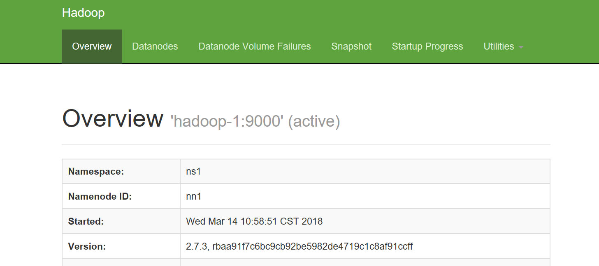
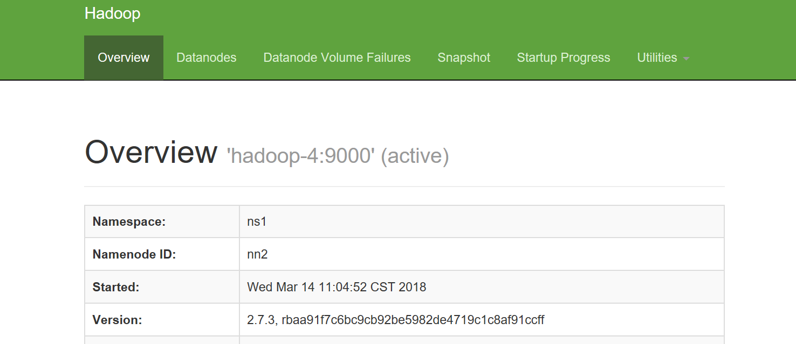

Hadoop environment for test
====
1.版本组件选择
---
* OS-->CentOS7.2
* jdk-->1.8_161
* hadoop-->2.7.3
* zookeeper-->3.4.8  

2.角色规划
---
* hadoop-1  datanode namenode DFSZKFailoverController  

* hadoop-2  datanode zookeeper journalnode NM  

* hadoop-3  datanode zookeeper journalnode RM NM  
* hadoop-4  datanode Secondnamenode NM DFSZKFailoverController  
* hadoop-5  datanode zookeeper journalnode NM SecondRM  
* 每个节点添加2块盘作为hdfs 数据盘  
3.基础环境搭建  
---
* 安装操作系统并为机器配置IP（省略）  
 
节点1上
```bash
hostnamectl set-hostname hadoop-1  

systemctl stop firewalld && systemctl disable firewalld  

sed -i 's/enforcing/disabled/g' /etc/selinux/config  

setenforce 0   
```

节点2上
```bash
hostnamectl set-hostname hadoop-2  

systemctl stop firewalld && systemctl disable firewalld  

sed -i 's/enforcing/disabled/g' /etc/selinux/config  

setenforce 0  
```
节点3上  
```bash
hostnamectl set-hostname hadoop-3  

systemctl stop firewalld && systemctl disable firewalld  

sed -i 's/enforcing/disabled/g' /etc/selinux/config  

setenforce 0   
```
节点4上  
```bash
hostnamectl set-hostname hadoop-4  

systemctl stop firewalld && systemctl disable firewalld  

sed -i 's/enforcing/disabled/g' /etc/selinux/config  

setenforce 0  
```
节点5上  
```bash
hostnamectl set-hostname hadoop-5  

systemctl stop firewalld && systemctl disable firewalld  

sed -i 's/enforcing/disabled/g' /etc/selinux/config  

setenforce 0  
```
配置时钟同步（NTP）
所有节点  
```bash
timedatectl set-timezone Asia/Shanghai
yum install -y ntp  
```
这里选择节点1作为时钟同步源 
修改ntp.conf文件修改如下部分  
```vim

restrict 192.168.1.0 mask 255.255.255.0 nomodify notrap

server 202.120.2.101 iburst（只留这一个，其他注释掉）  
```
其他节点 ntp.conf  
```vim
server hadoop-1 iburst（只留这一个，其他注释掉）  
```
启动ntp  
```bash
service ntpd start
ntpq -p  
```
安装jdk  
```bash
yum install -y java-1.8.0-openjdk  

yum install -y java-1.8.0-openjdk 
```
配置java环境变量  
修改/etc/profile加入如下部分  
```vim
JAVA_HOME=/usr/lib/jvm/java-1.8.0-openjdk
PATH=$JAVA_HOME/bin
CLASSPATH=.:$JAVA_HOME/lib/dt.jar:$JAVA_HOME/lib/tools.jar
export JAVA_HOME
export PATH
export CLASSPATH
export PATH=/usr/local/sbin:/usr/local/bin:/usr/sbin:/usr/bin:/root/bin:$PATH
export JRE_HOME=$JAVA_HOME/jre
export HADOOP_HOME=/usr/local/hadoop/hadoop-2.7.3
export SPARK_HOME=/usr/local/spark/spark-2.2.1-bin-hadoop2.7
export MAVEN_HOME=/usr/local/hadoop-maven-3.39/apache-maven-3.3.9
export HBASE_HOME=/usr/local/hbase-1.2.4
export PATH=$PATH:$JAVA_HOME/bin:$HADOOP_HOME/bin:$HBASE_HOME/bin:$SPARK_HOME/bin:$HADOOP_HOME/sbin
```
配置hosts文件
添加内容如下  
```vim
192.168.1.115 hadoop-1  
192.168.1.116 hadoop-2  
192.168.1.117 hadoop-3  
192.168.1.118 hadoop-4  
192.168.1.119 hadoop-5  
```
配置免密登陆（所有节点执行）需要输入密码 
```bash
ssh-keygen -t rsa
ssh-copy-id -i .ssh/id_rsa.pub hadoop-1  
ssh-copy-id -i .ssh/id_rsa.pub hadoop-2  
ssh-copy-id -i .ssh/id_rsa.pub hadoop-3  
ssh-copy-id -i .ssh/id_rsa.pub hadoop-4  
ssh-copy-id -i .ssh/id_rsa.pub hadoop-5  
```
将下载好的hadoop压缩包上传到hadoop-1上,zookeeper上传到hadoop-2上
hadoop-1节点  
```bash
tar -zxf hadoop-2.7.3.tar.gz -C /usr/local  
```
hadoop-2节点
```bash
tar -zxf zookeeper-3.4.8.tar.gz -C /usr/local
cd /usr/local/zookeeper/zookeeper-3.4.8/conf
cp zoo_sample.cfg zoo.cfg
mkdir -p /usr/local/zookeeper/zookeeper-3.4.8/data
cd /usr/local/
scp -r zookeeper/ hadoop-3:/usr/local
scp -r zookeeper/ hadoop-5:/usr/local
``` 
修改zoo.cfg  
加入以下部分  
```vim
dataDir=/usr/local/zookeeper/zookeeper-3.4.8/data
dataLogDir=/usr/local/zookeeper/zookeeper-3.4.8/logs
server.1=hadoop-2:2888:3888
server.2=hadoop-3:2888:3888
server.3=hadoop-5:2888:3888
```
hadoop-2节点 
```bash
cd /usr/local/zookeeper/zookeeper-3.4.8/data
echo "1" > myid
```
hadoop-3节点  
```bash
cd /usr/local/zookeeper/zookeeper-3.4.8/data
echo "2" > myid 
```
hadoop-5节点  
```bash
cd /usr/local/zookeeper/zookeeper-3.4.8/data
echo "3" > myid 
```
hadoop-2,hadoop-3,hadoop-5执行  
```bash
/usr/local/zookeeper/zookeeper-3.4.8/bin/zkServer.sh start
```
选取一个节点查看leader状态  
```bash
/usr/local/zookeeper/zookeeper-3.4.8/bin/zkServer.sh status
```
显示如下则正常  
```vim
ZooKeeper JMX enabled by default
Using config: /usr/local/zookeeper/zookeeper-3.4.8/bin/../conf/zoo.cfg
Mode: follower或者leader
```
配置Hadoop   
---
修改/usr/local/hadoop/hadoop-2.7.3/etc/hadoop下配置文件
hdfs-site.xml如下
```xml
	<property>
		<name>dfs.nameservices</name> 
		<value>ns1</value>
	</property>
	<property>
		<name>dfs.ha.namenodes.ns1</name> 
		<value>nn1,nn2</value>
	</property>
	<property> 
		<name>dfs.namenode.rpc-address.ns1.nn1</name>
		<value>hadoop-1:9000</value>
	</property>
	<property>
		<name>dfs.namenode.http-address.ns1.nn1</name> 
		<value>hadoop-1:50070</value>
	</property>
	<property>
		<name>dfs.namenode.rpc-address.ns1.nn2</name> 
		<value>hadoop-4:9000</value>
	</property>
	<property>
		<name>dfs.namenode.http-address.ns1.nn2</name> 
		<value>hadoop-4:50070</value>
	</property>
	<property>
		<name>dfs.namenode.shared.edits.dir</name>  
		<value>qjournal://hadoop-5:8485;hadoop-3:8485;hadoop-2:8485/ns1</value>
	</property>
	<property>                         
		<name>dfs.journalnode.edits.dir</name>   
		<value>/mnt1/journaldata</value>
	</property>
	<property>
		<name>dfs.ha.automatic-failover.enabled</name> 
		<value>true</value>
	</property>
	<property>
		<name>dfs.client.failover.proxy.provider.ns1</name>
		<value>org.apache.hadoop.hdfs.server.namenode.ha.ConfiguredFailoverProxyProvider</value>
	</property>
	<property>
		<name>dfs.ha.fencing.methods</name> 
		<value>sshfence</value>
	</property>
	<property>
		<name>dfs.ha.fencing.ssh.private-key-files</name> 
		<value>/root/.ssh/id_rsa</value>
	</property>
	<property>
		<name>dfs.ha.fencing.ssh.connect-timeout</name> 
		<value>30000</value>
	</property>
	<property>
		<name>dfs.replication</name> 
		<value>2</value>
	</property>
	<property>
		<name>dfs.permissions</name>
		<value>false</value>
	</property>
        <property>
                <name>dfs.namenode.name.dir</name> 
                <value>file:/mnt1/tmp/dfs/name,file:/mnt2/tmp/dfs/name</value>
        </property>
	<property>
                <name>dfs.datanode.data.dir</name>
                <value>file:/mnt1/tmp/dfs/data,file:/mnt2/tmp/dfs/data</value>
        </property>
```
hadoop-env.sh文件  
指定java路径
```vim
export JAVA_HOME=/usr/lib/jvm/java-1.8.0-openjdk
```  
core-site.xml文件如下
```xml
	<property>
		<name>fs.defaultFS</name>  
		<value>hdfs://ns1</value>
	</property>
	<property>
		<name>hadoop.tmp.dir</name>  
		<value>/mnt1/tmp,/mnt2/tmp</value>
	</property>
	<property>
		<name>ha.zookeeper.quorum</name> 
		<value>hadoop-3:2181,hadoop-2:2181,hadoop-5:2181</value> 
	</property>
	<property>
		<name>fs.checkpoint.period</name> 
	        <value>3600</value>
	</property>
```
yarn-site.xml文件  
```xml
	<property>
		<name>yarn.resourcemanager.ha.enabled</name>
		<value>true</value>
	</property>
	<property>
		<name>yarn.resourcemanager.cluster-id</name>
		<value>yrc</value>
	</property>
	<property>
		<name>yarn.resourcemanager.ha.rm-ids</name>
		<value>rm1,rm2</value>
	</property>
	<property>
		<name>yarn.resourcemanager.hostname.rm1</name>
		<value>hadoop-3</value>
	</property>
	<property>
		<name>yarn.resourcemanager.hostname.rm2</name>
                <value>hadoop-5</value>
	</property>
	<property>
		<name>yarn.resourcemanager.address.rm1</name>
                <value>hadoop-3:8032</value>
	</property>
	<property>
		<name>yarn.resourcemanager.address.rm2</name>
                <value>hadoop-5:8032</value>
        </property>
	<property>
		<name>yarn.resourcemanager.scheduler.address.rm1</name>
                <value>hadoop-3:8030</value>
        </property>
	<property>
		<name>yarn.resourcemanager.scheduler.address.rm2</name>
                <value>hadoop-5:8030</value>
        </property>
	<property>
		<name>yarn.resourcemanager.resource-tracker.address.rm1</name>
                <value>hadoop-3:8031</value>
        </property>
	<property>
		<name>yarn.resourcemanager.resource-tracker.address.rm2</name>
                <value>hadoop-5:8031</value>
	</property>
        <property>
		<name>yarn.resourcemanager.admin.address.rm1</name>
                <value>hadoop-3:8033</value>
        </property>
        <property>
		<name>yarn.resourcemanager.admin.address.rm2</name>
                <value>hadoop-5:8033</value>
        </property>
        <property>
		<name>yarn.resourcemanager.webapp.address.rm1</name>
                <value>hadoop-3:8088</value>
        </property>
        <property>
		<name>yarn.resourcemanager.webapp.address.rm2</name>
                <value>hadoop-5:8088</value>
        </property>
	<property>
		<name>yarn.resourcemanager.zk-address</name>
		<value>hadoop-3:2181,hadoop-2:2181,hadoop-5:2181</value>
	</property>
	<property>
		<name>yarn.nodemanager.aux-services</name>
		<value>mapreduce_shuffle</value>
	</property>
```
slaves文件 
```vim
hadoop-1
hadoop-2
hadoop-3
hadoop-4
hadoop-5
```
写个脚本fenfa.sh
内容如下  
```vim
#!/bin/sh
for i in 2 3 4 5
do
scp -rq /usr/local/hadoop/ root@hadoop-$i:/usr/local/
#scp -rq /usr/local/spark/ root@hadoop-$i:/usr/local/
done
```
```bash
sh fenfa.sh
```
namenode节点(hadoop-1,hadoop-4)     
```bash
hdfs zkfc -formatZK
```
journalnode节点(hadoop-2,hadoop-3,hadoop-5)  
```bash
hadoop-daemon.sh start journalnode
```
主namenode节点(hadoop-1)  
```bash
hdfs namenode -format ns1
hadoop-daemon.sh start namenode
```
备namenode节点(hadoop-4)
```bash
hdfs namenode -bootstrapStandby
hadoop-daemon.sh start namenode
```
hadoop-1和hadoop-4节点  

```bash
hadoop-daemon.sh start zkfc
```

datanode节点(hadoop-1,hadoop-2,hadoop-3,hadoop-4,hadoop-5)
```bash
hadoop-daemon.sh start datanode
```
hadoop-3节点 
```bash
start-yarn.sh
```
HA测试  
---  

可以看到现在是active
```bash
jps
kill -9 ID(namenode)
```

可以看到namenode状态已经切换  
有可能无法切换成功，原因一般是fuser命令无法找到 
yum install psmisc


