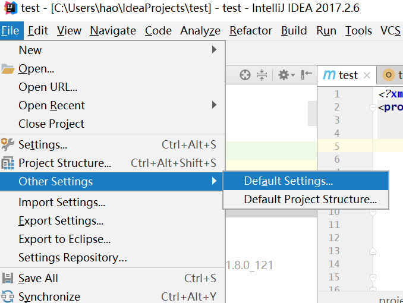

  
Spark Develop environment Build
====
1.版本信息
---
* Idea 2017.6  
* java 1.8_161  
* maven 3.3.9  

2.修改maven源为国内源
---
  

修改下面路径xml文件  

  


setting.xml配置如下  
```xml
<?xml version="1.0" encoding="UTF-8"?>
<settings xmlns="http://maven.apache.org/SETTINGS/1.0.0" 
    xmlns:xsi="http://www.w3.org/2001/XMLSchema-instance" 
    xsi:schemaLocation="http://maven.apache.org/SETTINGS/1.0.0 http://maven.apache.org/xsd/settings-1.0.0.xsd">
    
    <pluginGroups />
    <proxies />
    <servers />
    
    <localRepository>C:\Users\hao\.m2\repository</localRepository>
    
    <mirrors>
        <mirror>
            <id>alimaven</id>
            <mirrorOf>central</mirrorOf>
            <name>aliyun maven</name>
            <url>http://maven.aliyun.com/nexus/content/repositories/central/</url>
        </mirror>
        <mirror>
            <id>alimaven</id>
            <name>aliyun maven</name>
            <url>http://maven.aliyun.com/nexus/content/groups/public/</url>
            <mirrorOf>central</mirrorOf>
        </mirror>
        <mirror>
            <id>central</id>
            <name>Maven Repository Switchboard</name>
            <url>http://repo1.maven.org/maven2/</url>
            <mirrorOf>central</mirrorOf>
        </mirror>
        <mirror>
            <id>repo2</id>
            <mirrorOf>central</mirrorOf>
            <name>Human Readable Name for this Mirror.</name>
            <url>http://repo2.maven.org/maven2/</url>
        </mirror>
        <mirror>
            <id>ibiblio</id>
            <mirrorOf>central</mirrorOf>
            <name>Human Readable Name for this Mirror.</name>
            <url>http://mirrors.ibiblio.org/pub/mirrors/maven2/</url>
        </mirror>
        <mirror>
            <id>jboss-public-repository-group</id>
            <mirrorOf>central</mirrorOf>
            <name>JBoss Public Repository Group</name>
            <url>http://repository.jboss.org/nexus/content/groups/public</url>
        </mirror>
        <mirror>
            <id>google-maven-central</id>
            <name>Google Maven Central</name>
            <url>https://maven-central.storage.googleapis.com
            </url>
            <mirrorOf>central</mirrorOf>
        </mirror>
        <!-- 中央仓库在中国的镜像 -->
        <mirror>
            <id>maven.net.cn</id>
            <name>oneof the central mirrors in china</name>
            <url>http://maven.net.cn/content/groups/public/</url>
            <mirrorOf>central</mirrorOf>
        </mirror>
    </mirrors>
    
</settings>
```  

3.使用maven构建Spark开发环境  
----
调试组件包含(kafka,hive,hbase,sql)目前暂时用到这些  
pom.xml内容如下  

```xml
<?xml version="1.0" encoding="UTF-8"?>
<project xmlns="http://maven.apache.org/POM/4.0.0"
         xmlns:xsi="http://www.w3.org/2001/XMLSchema-instance"
         xsi:schemaLocation="http://maven.apache.org/POM/4.0.0 http://maven.apache.org/xsd/maven-4.0.0.xsd">
    <modelVersion>4.0.0</modelVersion>

    <groupId>test</groupId>
    <artifactId>test</artifactId>
    <version>1.0-SNAPSHOT</version>
    <properties>
        <spark.version>2.2.1</spark.version>
        <scala.version>2.11</scala.version>
    </properties>

    <dependencies>
        <dependency>
            <groupId>org.apache.spark</groupId>
            <artifactId>spark-core_${scala.version}</artifactId>
            <version>${spark.version}</version>
        </dependency>
        <dependency>
            <groupId>org.apache.spark</groupId>
            <artifactId>spark-streaming_${scala.version}</artifactId>
            <version>${spark.version}</version>
        </dependency>
        <dependency>
            <groupId>org.apache.spark</groupId>
            <artifactId>spark-streaming-kafka-0-10_${scala.version}</artifactId>
            <version>${spark.version}</version>
        </dependency>
        <dependency>
            <groupId>org.apache.spark</groupId>
            <artifactId>spark-streaming_${scala.version}</artifactId>
            <version>${spark.version}</version>
        </dependency>
        <dependency>
            <groupId>org.apache.hbase</groupId>
            <artifactId>hbase-client</artifactId>
            <version>1.2.4</version>
        </dependency>
        <dependency>
            <groupId>org.apache.hbase</groupId>
            <artifactId>hbase-server</artifactId>
            <version>1.2.4</version>
        </dependency>

        <dependency>
            <groupId>org.apache.spark</groupId>
            <artifactId>spark-sql-kafka-0-10_2.11</artifactId>
            <version>2.2.1</version>
        </dependency>
        <dependency>
            <groupId>org.apache.spark</groupId>
            <artifactId>spark-sql_${scala.version}</artifactId>
            <version>${spark.version}</version>
        </dependency>
        <dependency>
            <groupId>org.apache.spark</groupId>
            <artifactId>spark-hive_${scala.version}</artifactId>
            <version>${spark.version}</version>
        </dependency>
        <dependency>
            <groupId>org.apache.spark</groupId>
            <artifactId>spark-mllib_${scala.version}</artifactId>
            <version>${spark.version}</version>
        </dependency>

    </dependencies>

    <build>
        <plugins>

            <plugin>
                <groupId>org.scala-tools</groupId>
                <artifactId>maven-scala-plugin</artifactId>
                <version>2.15.2</version>
                <executions>
                    <execution>
                        <goals>
                            <goal>compile</goal>
                            <goal>testCompile</goal>
                        </goals>
                    </execution>
                </executions>
            </plugin>

            <plugin>
                <artifactId>maven-compiler-plugin</artifactId>
                <version>3.6.0</version>
                <configuration>
                    <source>1.8</source>
                    <target>1.8</target>
                </configuration>
            </plugin>

            <plugin>
                <groupId>org.apache.maven.plugins</groupId>
                <artifactId>maven-surefire-plugin</artifactId>
                <version>2.19</version>
                <configuration>
                    <skip>true</skip>
                </configuration>
            </plugin>

        </plugins>
    </build>

</project>
```
ok,enjoy it
===
