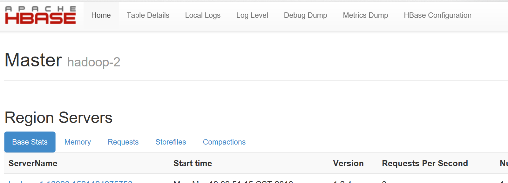
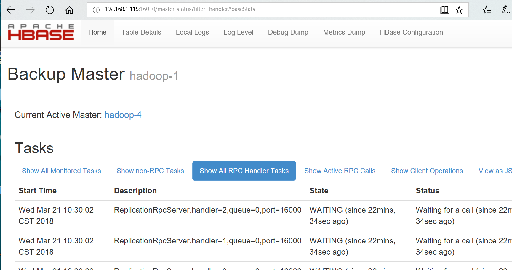

Hbase Environment Build and Spark operate Hbase
======
1.OS信息  
---

* OS-->centos7.2  
* Hadoop-->2.7.3
* zookeeper-->3.4.8  
* Hbase-->1.2.4  
* JDK-->1.8_161  

2.hbase角色规划  
------
* 192.168.1.115 HRegionServer  HMaster
* 192.168.1.116 HMaster  
* 192.168.1.117 HRegionServer  
* 192.168.1.118 HMaster HRegionServer  
* 192.168.1.119 HRegionServer  

3.集群配置  
---  

Hadoop参考<http://192.168.1.3/root/Hadoop.git>  
官网下载hbase-1.2.4-bin.tar.gz解压  
```bash
tar -zxf hbase-1.2.4-bin.tar.gz -C /usr/local/
cd /usr/local/hbase-1.2.4/conf
```
修改hbase-site.xml
```vim
<configuration>
    <property>
        <name>hbase.rootdir</name>
        <value>hdfs://ns1/hbase</value>
    </property>
    <property>
        <name>hbase.cluster.distributed</name>
        <value>true</value>
    </property>
    <property>
        <name>hbase.zookeeper.quorum</name>
        <value>hadoop-2:2181,hadoop-3:2181,hadoop-5:2181</value>
    </property>

</configuration>
```
修改hbase-env.sh
禁用自带zookeeper  

```vim
export HBASE_MANAGES_ZK=false
export JAVA_HOME=/usr/lib/jvm/java-1.8.0-openjdk
```
修改regionservers
```bash
vi regionservers
```
```vim
hadoop-3
hadoop-1
hadoop-4
hadoop-5
```
新建backup-masters
```bash
vi backup-masters
```
```vim
hadoop-1
hadoop-4
```
将HADOOP_HOME/etc/conf下hdfs-site.xml，core-site.xml拷贝到/usr/local/hbase-1.2.4/conf下  
4.启动  
--- 

在hadoop-2节点  
```bash
start-hbase.sh
```
5.HA测试  
---  
打开浏览器，输入http://192.168.1.116:16010
即可看到HMaster节点状态，如下:  
  

在hadoop-2节点，关闭HMaster  
```bash
hbase-daemon.sh stop master
```
然后在浏览器输入备节点地址http://192.168.1.115:16010  

  


6.Spark 写入Hbase
----
通过Spark创建一张表，并插入100万条数据  
代码如下  

```scala
import org.apache.hadoop.hbase.{HBaseConfiguration, TableName}
import org.apache.hadoop.hbase.client.{ConnectionFactory, Put}
import org.apache.hadoop.hbase.io.ImmutableBytesWritable
import org.apache.hadoop.hbase.mapred.TableOutputFormat
import org.apache.hadoop.hbase.util.Bytes
import org.apache.hadoop.mapred.JobConf
import org.apache.spark.{SparkConf, SparkContext}
import org.apache.spark.streaming.{Seconds, StreamingContext}


object testhbase {
  def main(args: Array[String]): Unit = {
    val conf = new SparkConf().setMaster("spark://192.168.1.116:7077").setAppName("hbase").setJars(List("C:\\Users\\hao\\IdeaProjects\\test\\out\\artifacts\\test_jar\\test.jar"))
    val sc=new SparkContext(conf)
    val rdd = sc.makeRDD(Array(1)).flatMap(_ => 0 to 1000000)
    rdd.foreachPartition(x => {
      val hbaseConf = HBaseConfiguration.create()
      hbaseConf.set("hbase.zookeeper.quorum", "hadoop-2,hadoop-3,hadoop-5")
      hbaseConf.set("hbase.zookeeper.property.clientPort", "2181")
      hbaseConf.set("hbase.defaults.for.version.skip", "true")
      val hbaseConn = ConnectionFactory.createConnection(hbaseConf)
      val table = hbaseConn.getTable(TableName.valueOf("word"))
      x.foreach(value => {
        var put = new Put(Bytes.toBytes(value.toString))
        put.addColumn(Bytes.toBytes("f1"), Bytes.toBytes("c1"), Bytes.toBytes(value.toString))
        table.put(put)
      })
    })
  }
}
```
7.Spark读取Hbase表并存入到hdfs中
----
代码如下

```scala
import org.apache.hadoop.hbase.HBaseConfiguration  
import org.apache.hadoop.hbase.mapreduce.TableInputFormat  
import org.apache.hadoop.hbase.io.ImmutableBytesWritable  
import org.apache.hadoop.hbase.client.Result  
import org.apache.hadoop.hbase.HConstants  
  
val tmpConf = HBaseConfiguration.create()  
tmpConf.set("hbase.zookeeper.quorum", "hadoop-2,hadoop-3,hadoop-5")  
tmpConf.set("hbase.zookeeper.property.clientPort", "2181")  
tmpConf.set(TableInputFormat.INPUT_TABLE, "word")  
tmpConf.set(HConstants.HBASE_CLIENT_SCANNER_TIMEOUT_PERIOD, "120000");     
val hBaseRDD = sc.newAPIHadoopRDD(tmpConf, classOf[TableInputFormat],classOf[ImmutableBytesWritable],classOf[Result])  
val lineRdd=hBaseRDD.map(r=>  
    (if(r._2.getFamilyMap("comumnfamily".getBytes).keySet.contains("column1".getBytes)){new String(r._2.getValue("data".getBytes,"log_date".getBytes))}else{"0"})+","+  
    (if(r._2.getFamilyMap("comumnfamily".getBytes).keySet.contains("column2".getBytes)){new String(r._2.getValue("data".getBytes,"area_code".getBytes))}else{"0"})  
)
lineRdd.saveAsTextFile("hdfs://ns1/hbasehdfs01")

lineRdd.repartition(1).saveAsTextFile("hdfs://ns1/hbasehdfs")
```